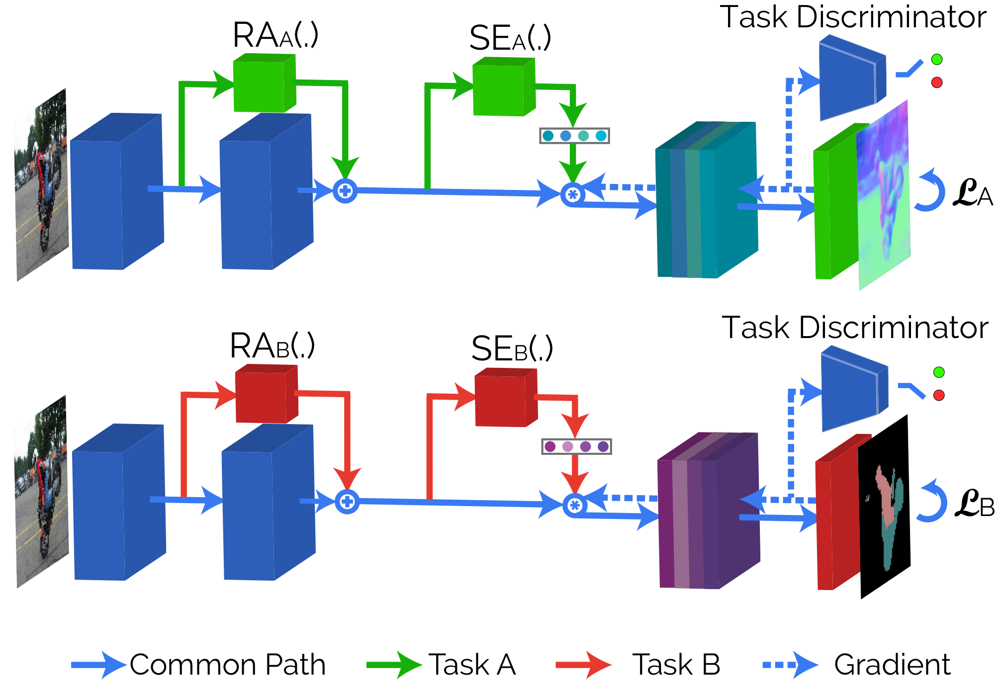
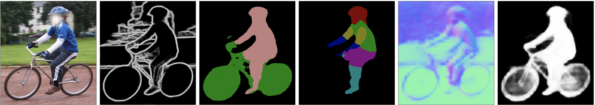

# Attentive Single-Tasking of Multiple Tasks
Visit our [project page](http://www.vision.ee.ethz.ch/~kmaninis/astmt) for accessing the paper, and the pre-computed results.

<p align="center">

</p>

This is the implementation (in PyTorch) of the following paper:
 
*[Kevis-Kokitsi Maninis](http://www.vision.ee.ethz.ch/~kmaninis/), [Ilija Radosavovic](http://www.ilijar.com/), and [Iasonas Kokkinos](http://www0.cs.ucl.ac.uk/staff/I.Kokkinos/index.html).
["Attentive Single-Tasking of Multiple Tasks"](https://arxiv.org/abs/1904.08918), in CVPR 2019.*

```
@InProceedings{MRK19,
  Author    = {K.K. Maninis and I. Radosavovic and I. Kokkinos},
  Title     = {Attentive Single-Tasking of Multiple Tasks},
  Booktitle = {IEEE Conference on Computer Vision and Pattern Recognition (CVPR)},
  Year      = {2019}
}
```

### Abstract
In this work we address task interference in universal networks by considering that a network is trained on multiple tasks, but performs one task at a time, an approach we refer to as "single-tasking multiple tasks". The network thus modifies its behaviour through task-dependent feature adaptation, or task attention. This gives the network the ability to accentuate the features that are adapted to a task, while shunning irrelevant ones. We further reduce task interference by forcing the task gradients to be statistically indistinguishable through adversarial training, ensuring that the common backbone architecture serving all tasks is not dominated by any of the task-specific gradients.   
Results in three multi-task dense labelling problems consistently show: (i)  a large reduction in the number of parameters while preserving, or even improving performance and (ii) a smooth trade-off between computation and multi-task accuracy.

### Results
Example performance on PASCAL Context, for ResNet-101 backbone (more results in the paper):

|  Experiment   | Edge Detection (F) | Semantic Segmentation (mIoU) | Human Parts (mIoU) | Surface Normals (mErr) | Saliency (mIoU)| Average Drop (%)|
| ------------  | ------------------ | ---------------------------- | ------------------ | ---------------------- | -------------- | --------------- |
|  Single Task  |        72.7        |            68.30             |       60.70        |           14.61        |      65.40     |          -      |
| MTL w/o ASTMT |        69.2        |            63.20             |       55.10        |           16.04        |      63.60     |         6.81    |
| MTL w/ ASTMT  |        72.4        |            68.00             |       61.12        |           14.68        |      65.71     |         0.04    |
 
<p align="center">

</p>


### License

This repository is released under the following [LICENSE](https://github.com/facebookresearch/astmt/blob/master/LICENSE).

###  Installation / Setup:

This code was tested with Python 3.6, PyTorch 0.4.1/1.0, and CUDA 9.0.

0. Install PyTorch
    ```
    conda install pytorch=0.4.1 torchvision cuda90 -c pytorch
    ```

1. Install additional dependencies.
    ```
    conda install scikit-image pillow
    pip install graphviz opencv-python easydict pycocotools
    pip install tensorboard tensorboardx tensorflow
    ```
    
2. Clone the multi-task repo.
    ```
    git clone https://github.com/facebookresearch/astmt.git
    ```

3. Add the multi-task package directory, easiest if you initialize it into your ~/.bashrc.
    ```
    echo "export PYTHONPATH=$PYTHONPATH:/path/to/this/repo/" >> ~/.bashrc
    ```
    
4. Move (copy) `mypath.py` underd `util/`. Complete the `/path/to/something/` paths. 


### Experiments

The experiments that result in the findings of the paper can be found under `experiments/dense_predict/`.
For example, in order to test ASTMT on PASCAL (5 tasks) using modulation (squeeze and excitation, and residual adapters), and adversarial loss, run:
```
cd pascal_resnet
python main.py --resume_epoch 60
```

To train the model run:
```
python main.py 
```
This will train a resnet26 version of ASTMT. To use different setup (deeper network, etc.) please check `config.py` inside each experiment.

#### Use Tensorboard
- `cd /path/to/experiment`
- `tensorboard --logdir . --port XXXX` .If you are using port forwarding to your local machine, access through `localhost:XXXX`.

#### Evaluation
Evaluation scripts are run at the end of each experiments, and the results are dumped into the experiment's folder.
The evaluation part of boundary detection is disabled by default, since we used the MATLAB-based repo of [seism](https://github.com/jponttuset/seism).

Briefly, the following metrics has been implemented:
- `edge`: F-measures per dataset (odsF), F-measure per Instance (oisF), and Average Precision (AP).
- `semseg`: mean Intersection over Union (mIoU) per class.
- `human_part`: mean Intersection over Union (mIoU) per class.
- `normals`: Difference in predicted and ground-truth angles (mean, median, RMSE, < 11.25, < 22.5, < 30).
- `sal`: Maximal mean Intersection over Union (max mIoU) and maximal F (maxF).
- `albedo`: Mean Squared Error (MSE).
- `depth`: Mean Squared Error (MSE).

Enjoy :)


 
